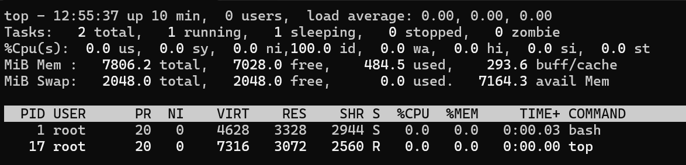
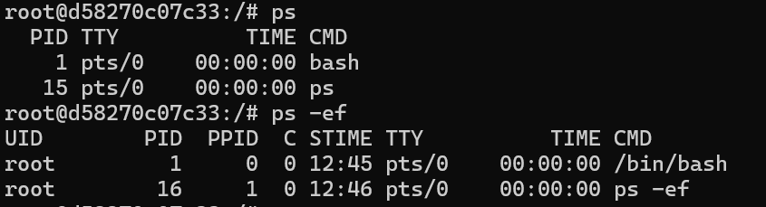
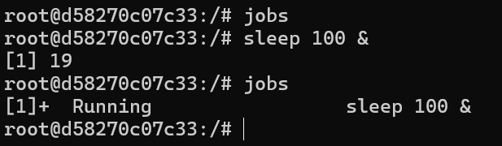
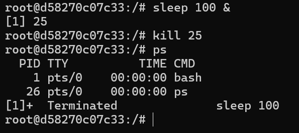

# 오픈소스sw개론 과제#2

리눅스 명령어 중에서 top, ps, jobs, kill에 대해서 조사하기

20213073 송상현

---

## 1. top (Table of Processes)

`top` 명령어는 시스템의 전체 프로세스 상태와 리소스(CPU, Memory) 사용량을 실시간(Real-time)으로 모니터링할 때 사용합니다. 

3초(기본값)마다 화면이 갱신되며, 시스템 부하가 높을 때 원인을 파악하기 가장 좋은 도구입니다.

### 주요 단축키 (Interactive Mode)

`top` 실행 상태에서 아래 키를 눌러 화면을 제어할 수 있습니다.

  - **`q`**: top 프로그램 종료
  - **`k`**: 특정 프로세스 종료 (PID 입력 프롬프트가 뜸)
  - **`1`**: CPU 코어별 상세 사용량 보기/접기
  - **`M`**: 메모리(Memory) 사용량 순으로 정렬
  - **`P`**: CPU(Processor) 사용량 순으로 정렬 (기본값)

### top 실행 화면 주요 필드 설명

실행 화면에 나타나는 각 항목의 의미는 다음과 같습니다.

* **PID**: 프로세스 ID (고유 번호)
* **USER**: 프로세스를 실행한 사용자
* **PR / NI**: 프로세스의 실행 우선순위 (Priority / Nice value)
* **VIRT**: 프로세스가 사용 중인 가상 메모리 양
* **RES**: 프로세스가 사용 중인 물리 메모리 양 (실제 메모리 점유율)
* **%CPU**: CPU 사용률
* **COMMAND**: 실행된 명령어 이름

### top 명령어 실행결과

---

## 2. ps (Process Status)

`ps` 명령어는 현재 실행 중인 프로세스의 상태를 스냅샷(Snapshot) 처럼 정적으로 보여줍니다.

### 주요 옵션 (Table)

| 옵션 | 설명 | 비고 |
| :---: | :--- | :--- |
| `-e` | 시스템의 모든 프로세스를 출력 | - |
| `-f` | 풀 포맷(Full format)으로 상세 정보 출력 | UID, PID, PPID 등 표시 |
| `aux` | BSD 문법으로 모든 프로세스를 상세히 출력 | 가장 많이 사용됨 (`ps aux`) |

### 출력 항목(Header) 의미

`ps -ef` 명령 실행 시 나타나는 주요 필드의 의미입니다.

| 필드명 | 의미 | 설명 |
| :---: | :---: | :--- |
| **UID** | User ID | 프로세스 소유자의 이름 |
| **PID** | Process ID | 프로세스의 고유 식별 번호 |
| **PPID** | Parent PID | 이 프로세스를 실행시킨 부모 프로세스의 ID |
| **STIME** | Start Time | 프로세스가 시작된 시간 |
| **CMD** | Command | 실행된 명령어 |

### ps 명령어 실행결과

---

## 3. jobs (Job Control)

`jobs`는 현재 쉘 세션(Shell Session) 내에서 실행 중인 백그라운드(Background) 작업들의 목록을 보여줍니다. 터미널 하나에서 여러 작업을 동시에 수행할 때 유용합니다.

### 작업 상태 (State)

1.  **Running**: 현재 백그라운드에서 실행 중인 상태
2.  **Stopped**: 일시 중단된 상태 (보통 `Ctrl + Z` 입력 시)
3.  **Done**: 작업이 완료된 상태

### 기호의 의미 (+, -)
`jobs` 명령 실행 시 작업 번호(`[1]`, `[2]`) 옆에 붙는 기호는 다음과 같습니다.

* **`+` (Current)**: 현재 처리 대상인 작업. `fg`나 `bg` 명령어 입력 시 우선적으로 적용됩니다.
* **`-` (Previous)**: `+` 작업 바로 이전에 접근했던 작업입니다.

### 포그라운드 & 백그라운드 제어

* **`&` (백그라운드 실행)**: 명령어 뒤에 `&`를 붙여 실행
* **`fg` (Foreground)**: 백그라운드 작업을 화면 앞으로 가져옴 (`fg %작업번호`)
* **`bg` (Background)**: 일시 정지된(Stopped) 작업을 백그라운드에서 다시 실행 (`bg %작업번호`)

### jobs 실행 결과

---

## 4. kill (Terminate Process)

`kill` 명령어는 프로세스에 특정 시그널(Signal)을 보내 제어하는 명령어입니다. 이름은 'kill'이지만, 종료 외에도 다양한 신호를 보낼 수 있습니다. 주로 응답하지 않거나 불필요한 프로세스를 정리할 때 사용합니다.

### 주요 시그널 종류 (Table)

가장 자주 사용되는 시그널은 아래와 같습니다.

| 시그널 번호 | 이름 | 설명 |
| :---: | :--- | :--- |
| **15** | `SIGTERM` | **정상 종료 요청 (기본값).** 프로세스가 스스로 리소스를 정리하고 종료할 시간을 줍니다. |
| **9** | `SIGKILL` | **강제 종료.** 프로세스의 의사를 묻지 않고 즉시 커널이 종료시킵니다. (데이터 유실 위험 있음) |
| **2** | `SIGINT` | **인터럽트.** 키보드로 `Ctrl + C`를 입력한 것과 동일한 효과입니다. |

### kill 실행 결과

